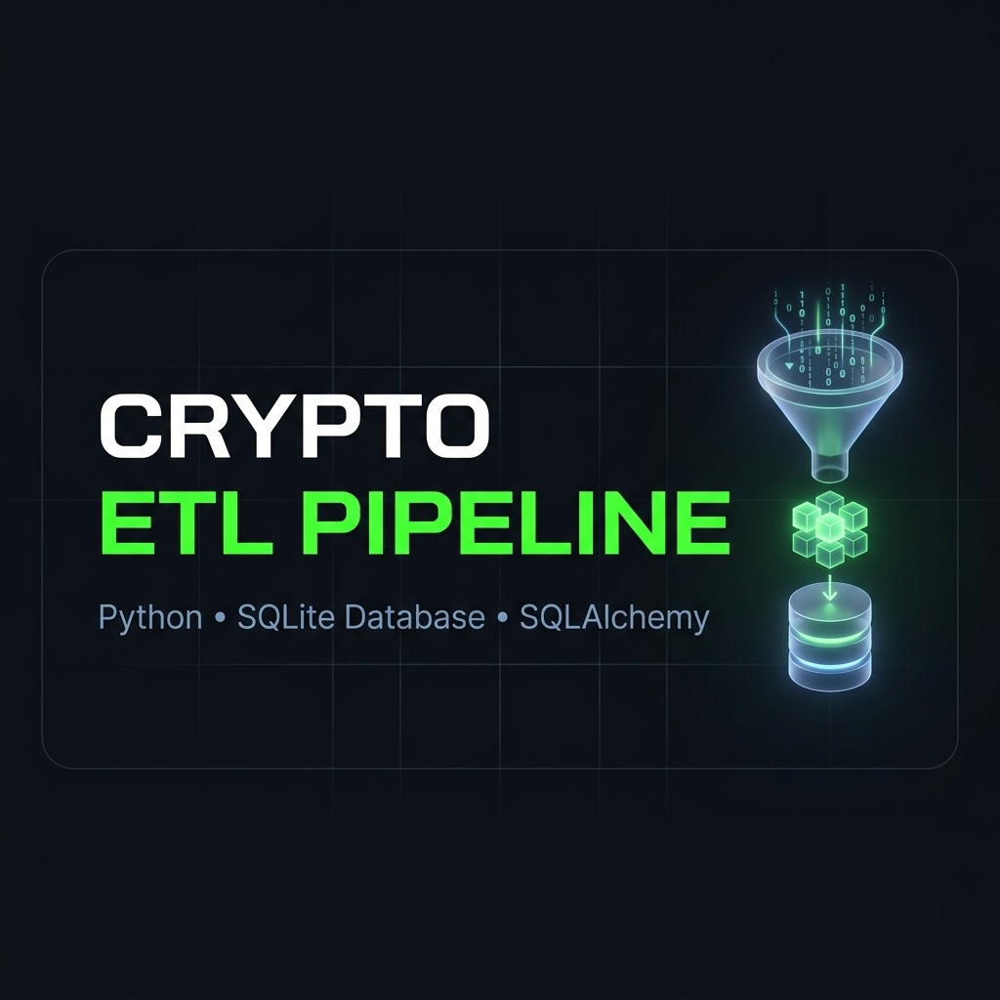
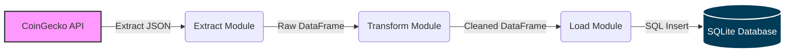

<div align="center">



# Crypto ETL Data Pipeline 🚀

**An automated, end-to-end Python data pipeline that extracts live cryptocurrency market data, transforms it for analysis, and loads it into a robust local SQLite database.**

[](https://www.python.org/)
[](https://pandas.pydata.org/)
[](https://www.sqlite.org/)
[](https://www.sqlalchemy.org/)
[](https://github.com/AItools-guru/crypto-etl-pipeline/actions/workflows/ci.yml)
[](https://opensource.org/licenses/MIT)

</div>

<br />

## 📖 Overview

The **Crypto ETL Data Pipeline** is designed to demonstrate modern Data Engineering workflows. By integrating directly with the [CoinGecko API](https://www.coingecko.com/en/api), this pipeline ingests live metrics for the top 100 cryptocurrencies by market cap. 

The pipeline ensures high data quality by handling missing values, standardizing formats, and engineering new financial features (such as rolling price spreads) before persistently storing the output in a relational database for downstream analytics and BI dashboards.

## 🏗 Architecture

The pipeline follows a classic **E-T-L (Extract, Transform, Load)** architecture:



1. **Extract (`src/extract.py`)**: Connects to the public CoinGecko REST API using `requests` and handles pagination/rate limits to pull raw JSON data.
2. **Transform (`src/transform.py`)**: Utilizes `pandas` to drop unnecessary columns, enforce datatypes, and calculate a `price_spread_24h` metric to analyze volatility.
3. **Load (`src/load.py`)**: Employs `SQLAlchemy` as an ORM layer to safely drop and recreate the `market_data` table, inserting the clean records into a localized `crypto_data.db`.

---

## 🚀 Getting Started

### Prerequisites
Make sure you have the following installed:
* Python 3.10 or higher
* Git

### Installation

1. **Clone the repository:**
   ```bash
   git clone https://github.com/your-username/crypto-etl-pipeline.git
   cd crypto-etl-pipeline
   ```

2. **Create a virtual environment:**
   ```bash
   python3 -m venv venv
   source venv/bin/activate  # On Windows use: venv\Scripts\activate
   ```

3. **Install dependencies:**
   ```bash
   pip install -r requirements.txt
   ```

### Running the Pipeline

Execute the main orchestration script:

```bash
python main.py
```

**Expected Output:**
```text
2026-05-23 10:00:00,000 - INFO - Starting ETL Pipeline...
2026-05-23 10:00:00,050 - INFO - Fetching top 100 cryptocurrencies in USD...
2026-05-23 10:00:01,200 - INFO - Successfully fetched data from CoinGecko.
2026-05-23 10:00:01,202 - INFO - Transforming data...
2026-05-23 10:00:01,215 - INFO - Transformation complete. Resulting shape: (100, 11)
2026-05-23 10:00:01,215 - INFO - Connecting to database at sqlite:///data/crypto_data.db...
2026-05-23 10:00:01,250 - INFO - Successfully loaded 100 rows into table 'market_data'.
2026-05-23 10:00:01,251 - INFO - ETL Pipeline finished successfully.
```

---

## 🗂 Project Structure

```bash
crypto-etl-pipeline/
├── src/
│   ├── extract.py      # Handles API requests and JSON parsing
│   ├── transform.py    # Core data cleaning & feature engineering
│   └── load.py         # SQLAlchemy DB connection and inserts
├── data/
│   └── crypto_data.db  # Generated SQLite database (Ignored by Git)
├── assets/
│   └── banner.png      # README hero image
├── main.py             # Orchestration entry point
├── requirements.txt    # Python dependencies
└── README.md           # You are here!
```

---

## 📊 Database Schema

The pipeline generates a `market_data` table with the following schema:

| Column Name | Data Type | Description |
| :--- | :--- | :--- |
| `id` | TEXT | Unique cryptocurrency identifier (e.g., 'bitcoin') |
| `symbol` | TEXT | Ticker symbol (e.g., 'btc') |
| `name` | TEXT | Full name of the asset |
| `current_price` | FLOAT | Current trading price in USD |
| `market_cap` | BIGINT | Total market capitalization |
| `market_cap_rank` | INTEGER | Rank relative to other assets |
| `total_volume` | BIGINT | 24-hour trading volume |
| `high_24h` | FLOAT | Highest price in the last 24h |
| `low_24h` | FLOAT | Lowest price in the last 24h |
| `last_updated` | DATETIME | Timestamp of the last data update |
| `price_spread_24h` | FLOAT | **[Engineered]** `high_24h` - `low_24h` |

---

<div align="center">
<i>Built with ❤️ for Data Engineering Portfolios.</i>
</div>

---

<h2 align="center">🧑‍💻 Author</h2>

<p align="center">
  <strong>Saurabh Shidhore</strong><br>
  <i>Project Manager | Business Analyst | AI Practitioner</i>
</p>

<p align="center">
  👉 <a href="https://www.linkedin.com/in/saurabhshidhore/">Connect on LinkedIn</a> | 💻 <a href="https://github.com/AItools-guru">Follow on GitHub</a>
</p>
